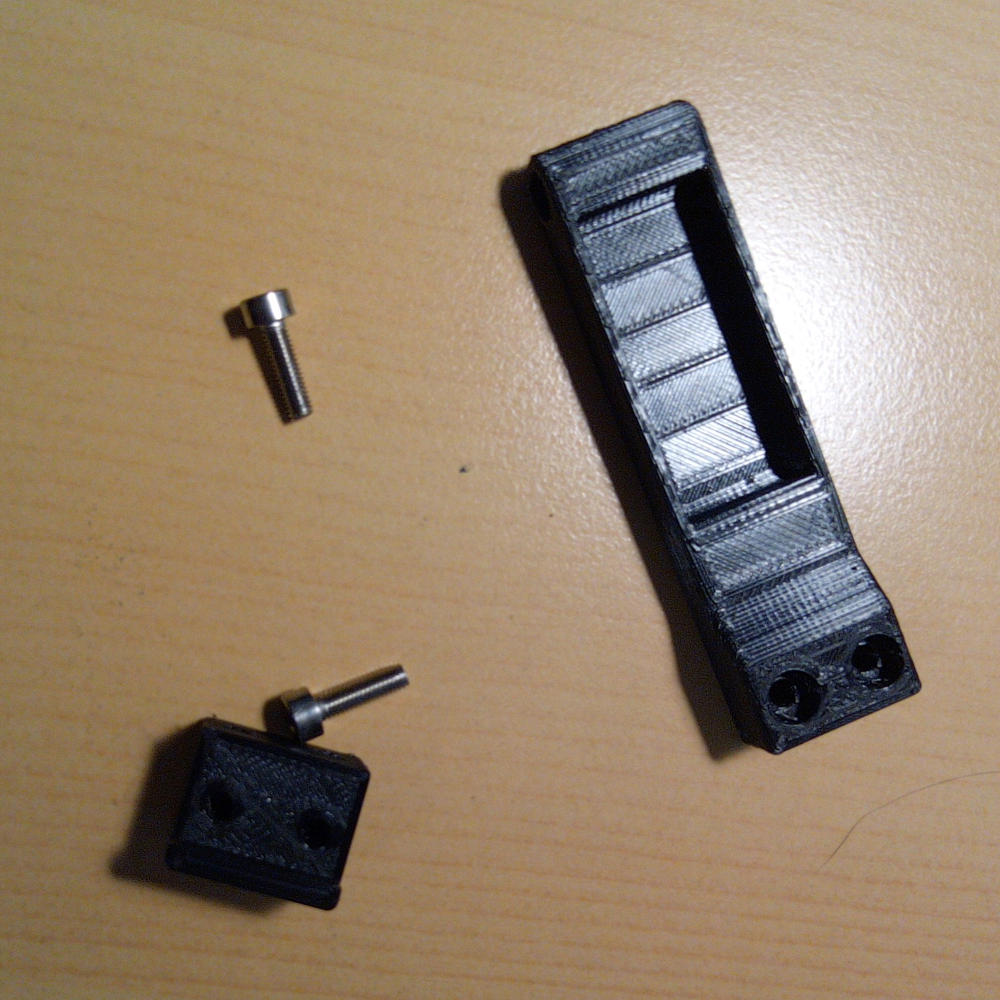

# Fanashifter

Project about how to connect shifters (sequential or H-shaped) on Fanatec Wheel bases, using it's internal
protocol. Tested with a sequential shifter on CSL elite 1.1. Also the 3D models for the Levers and electronics are provided.
In this example, we can connect directly our shifter levers to port Shifter2 (rj12) also works on Shifter1.


The problem is simple: interface the wheel base so we can send two signals, gear up, and gear down. Fanatec sells static paddles, 
a fully H-patter shifter, and also a sequential shifter. Some wheels include the shifters, also (as my BMW GT2 wheel). The problem
with that wheels in that the paddles moves along the wheel, so in tight turns (aka rally) you can't reach the paddles.

## Table Of Contents

1. [Project Features](#project-features)
2. [3D Printing and Assembly](#3d-printing-and-assembly)
    1. [Plate](#plate)
    2. [Reinforcements](#reinforcements)
    3. [Lever](#lever)
    4. [Lever adapter](#lever-adapter)
    5. [Alternate Lever](#alternate-lever)
    6. [Cap](#cap)
    7. [Base plate](#base-plate)
    8. [Rear Cap](#rear-cap)
    9. [Alternate Rear Cap](#alternate-rear-cap)
   10. [Cable box](#cable-box)
    
3. [Mounting](#mounting)    
4. [Fanatec Protocol](#protocol)
5. [Pinout](#pinout)


## Project Features

1. Fully printable, so you can download the project, start your printer, and print all the parts. The STL are 
ready to print, so the orientation and tolerances are configured and tested.
2. Uses the standard RJ12 port with it's internal protocol, so just plug and play.
3. Cheap to build. Based on standard hardware components:
    * Printed on PETG
    * Some wiring cable (8 wires)
    * 30 allen screws (13mm)
    * 4 allen screws (6mm)
    * 2 allen screews M4 (24 mm) for lever axis
    * 2 standard micro switch NO 
    * a RJ12 to RJ12-6p6c (all poles connected, 1-1) cable, to do the wiring.
    * 2 springs for the levers.
    

## 3D Printing and Assembly

All the parts are designed on Autodesk Inventor 2019. I provide the STL files. Printed on a Creality Ender-3 Pro, 
with BQ PETG. These are the CURA settings for all the parts printed:

* Layer Height: 0.2
* Wall Thickness: 0.8
* Top/Botton Thickness: 0.8
* Top Layers: 4
* Bottom Layers: 4
* Infill: 60%, Grid
* Printing temperature: 220 ºC 
* Build plate temperature: 80 ºC
* Speed: 50 mm/s
* Cooling: Enable
* Fan Speed: 100%
* Enable supports: Everywhere
* Build Plate adhesion: None

Note that all the parts are sturdy and the print time is about 3 hours for the plate. Let the printed print. Check
that the nozzle in clean (run small batches) because the PETG is very sticky and stringy.


<video id="video" width="100%" controls>
  <source src="video/assembly.mp4"
            type="video/mp4">
</video>

### Plate

This is the base plate where the parts are mounted and touches the wheel base using the screws. This plate is created
for the CSL-Elite 1.1, so be careful that hole position can change in CSL 2.5 or podium bases. Print it sturdy and 
slow to avoid bending when using the levers. About 3 hours to print.

<a href="stl/plate.stl">

</a>

### Reinforcements

This reinforcements (2x) are mounted at each side, pressing the levers with the plate, to avoid bending.

<a href="stl/reinforce.stl">

</a>

### Lever

The single lever. Fits into the base plate, and uses a M4x22mm screw as axis. It screws the lever adapter, to fit
the CSL BMW Motosport paddle shifters (it's my wheel). If you want, you can skip the lever adapter, and print a
custom pladdle and fit directly into the lever. In the back, there's a small recession to fit the spring inside.

<a href="stl/lever.stl">

</a>


### Lever Adapter

The lever adapter for the CSL BMW Motosport paddle shifters.

<a href="stl/lever-adapter.stl">

</a>

### Alternate Lever

This lever has the paddle integrated, and it's a little longer

<a href="stl/lever_alternate.stl">

</a>

### Cap

This part interfaces the plate with the lever using the base plate. This gives some angle and adds some separation
to the base.

<a href="stl/cap.stl">

</a>

### Base Plate

The lever is mounted here, and this is mounted on the cap to fit inside the plate.

<a href="stl/base_plate.stl">

</a>

### Rear Cap

A simple cap for hidding the switches. If you use standard switches with the GT2, the rear cap collides with the wheel's 
screws. It's better using a low profile micro switch to save space and make a rear cap thinner (TODO)

<a href="stl/rearcap.stl">

</a>

### Alternate Rear Cap

A simple cap for hidding the switches. If you use standard switches with the GT2, the rear cap collides with the wheel's 
screws. It's better using a low profile micro switch to save space and make a rear cap thinner (TODO). this cap is shorter
and fits better with the BMW GT2 wheel. 

<a href="stl/rearcap_alternate.stl">

</a>


### Cable Box

A simple box to hide the board and the cables. 

<a href="stl/cablebox.stl">

</a>

## Mounting

### Levers

First of all, mount the lever adapter into the levers. If you print your custom paddles, skip this step.
Add the spring into the back, and glue it.




### Base Plate

Insert the lever into the base plate, and pass the M4 screw as axis. Bolt it. Sand all the parts to get a 
smooth operation. Then, screw the cap tight. This part is the interface with the plate, and limits the 
travel of the lever. Screw the levers into the plate. You're done.


### Mounting on wheel base

Put the plate in the wheel base, and place the reinforcements. Screw the big M6 screws in position, and tight
it. I use some double tape to avoid any hold between reinforcement-cap and plate-wheelbase parts. Mount the
wheel and check that nothings collides and the wheel moves freely and smooth. Now, we can mount the 
electronic components.


4. [Fanatec Protocol](#protocol)

Fanatec wheel bases use a internal protocol to talk with their devices, and does this interface using 
RJ12-6p6c electrical interface cables. I don't wanna break my wheel base, so I check the internet, and 
find this amazing post: how to [convert the Fanatec Shifter to USB](https://hackaday.io/project/171155-fanatec-clubsport-shifter-sq-v15-usb-adapter-diy)
**Yin Zhong** does some amanzing reverse engineering and, with the of [this post](https://www.gtplanet.net/forum/threads/conversion-of-a-logitech-shifter-for-fanatec-wheelbase-compatibility-enabling-7th-gear-other-mods.384099/) and 
[this document](https://www.gtplanet.net/forum/attachments/conversion-of-a-logitech-shifter-for-fanatec-wheelbase-compatibility-by-b-spec-_-bob-dec-2018-pdf.787424/)
 I start to manage how to implement the solution.


## Pinout

Pinout RJ12 (6P6C)

The official colors of the wire differs from mine, but the key is the cable is a RJ12 6P6C (6 poles, 6 connected). Pins are
labeled using the following table (in CAPS are my wire's colors)

1. GND
2. SEQ low = H-pattern, high = sequential SEQ
3. internally shorted to pin 2
4. X axis (H-pattern); lever push (sequential)
5. Y axis (H-pattern); lever pull (sequential)
6. VCC

 


**PIN numbering**. The _notch_ of the connector is in the bottom. PIN 1 starts in the right side of the connector.

```
RJ12 6P6C
+---------------------------------------------------------------+
|   6    |   5   |     4      |    3       |    2     |    1    |
| yellow | brown | red,orange | See below  | Not Used |  Black  |
|  WHITE | BLACK |     RED    |   GREEN    |  YELLOW  |   BLUE  |
|  VCC   | Yaxis |    XAxis   | Short pin 2|    SEQ   |   GND   | 
+---------------------------------------------------------------+
                           |       |
                           | notch |        
                           |       |       
                           +-------+ 
```

* High means put it to VCC (high)
* Shorted is internally sorted (in our side), so connect PIN 3 with PIN 2.
* In our case, we want only **SEQUENTIAL SHIFTER**, so connect PIN 2 to **HIGH** (PIN 6). See the original post for info about H-shaped shifters.
* In **SEQ** (Sequential mode), PIN 5 (YAXIS) when **LOW** means "pull the lever" so downshift (lever of the left side of the wheel)
* In **SEQ** (Sequential mode), PIN 4 (XAXIS) when **LOW** means "push the lever" so upshift (lever of the right side of the wheel)

So the switches are mounted on a pullup configuration (using 10K resistors), so we can create a basic schema (sorry about my ASCII art):

```
SCHEMA

 (6) VCC
  x
  |                         
  |                                 
  +---------[ 10K ]---+-------/ ----------+
  |                   | (5) X             | 
  |                   x                   x (1) GND
  |                                       |         
  +---------[ 10K ]---+------/ -----------+
  |                   | (6) Y               
  |                   x
  |  
  +------x (3) 
  |
  +------x (2) SEQ
  |

  ```

To implement it, I use some custom-made board (TODO: create a simple PCB). I add some connectors to fix the cables (to allow some mounting / unmounting)
capabilities:

 
 

* Switches are **normally open** type. 
* **GND/COM** is wired to GND (the big blue connector in the board)
* In the green connector, wire the **NO (Normally open)** wire of the switch.
* Connect the RJ12 to the **SHIFTER2** port in CSL (I have a H-pattern connected to the **SHIFTER1** port), start the wheel, and test with the Fanatec Device page that the switches works.

I protect the boards' soldered layer using hot glue. Then, I put it into the cablebox and ziptie it to the rig.

You're done. Enjoy it.


